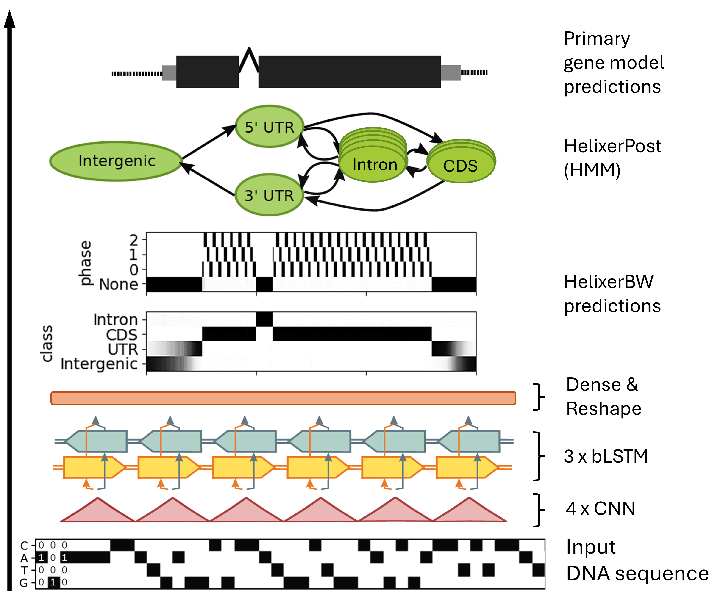

# Fine-tuning
The performance for current best Helixer models could
in practice be lower for some targets, 
particularly where no proximal high quality 
genomes were sufficiently represented in the training data
(often due to no availability of high quality genomes
for specific species or families at the time of training).

One option that is potentially easier than fully retraining
is fine-tuning. This has not been statistically evaluated, although
promising results have been reported.

There are three main options for fine-tuning:
1. [Fine-tune the whole network](#1-fine-tune-the-whole-network): prone to
overfitting (see Note 2 below here) if one is not careful; limited 
advantages over retraining from scratch
2. [Fine-tune only parts of the network](#2-fine-tune-only-parts-of-the-network)
(just train one or two new final layers): lower training data amount is needed,
compared to the first method; also usable when fine-tuning within one species
3. [Train new final layer(s) with extrinsic information](#3-train-new-final-layers-with-extrinsic-information):
extrinsic data (for example RNA-seq data) is added as the input
(additionally to the DNA sequence); in theory, the network
will learn the typical relation between high confidence
gene models and the supplied RNA-seq data; **most promising
fine-tuning option**

> **NOTE**: these are currently experimental, meaning:
> - they should be compared to alternatives and optimized as necessary
> - they are in some cases complicated and have not yet been
>   stream-lined for user-friendliness

We also provide short instructions on
[inference with fine-tuned models](#inference-with-fine-tuned-models) 

> **NOTE 2**: definition of a few important terms:
> - **overfit**: the neural network can fit/predict the training data perfectly,
> but can't perdict any other data accurately, resulting in a model that
> can only be used for data _very_ similar to the training data
> - **trained/pretrained model**: model that was already trained on the same or
> other training data
> - **epoch**: full training run, one iteration over the entire training data
> - **batch**: one sample of your training data, here a subsequence of the input
> DNA sequence (depending on the selected `--subsequence-length`; default size:
> ~21 kbp)
> - **batch size**: number of samples send through the neural network at once
> - **(training) step**: an epoch is made up of multiple (training) steps, i.e.
> if your training data contains 5,000 batches and your batch size is 50, then
> the number of steps per epoch is 1,000; after each step the networks parameters
> are evaluated and changed to make better predictions in the next step
> - **(neural network) weights**: a neural network is made up of many processing
> units/nodes/neurons that are organized into layers. Each connection between
> nodes has a weight assigned to it representing the strength of the connection.
> During training these weights change until the best network with the highest
> prediction accuracy for the validation set is found.

## Helixer's architecture
(shown for better understanding of Helixer's core architecture, input and output)


## 1. Fine-tune the whole Network
### 1.1 Info
This fine-tuning method is potentially just _**as subject to overfitting
as training from scratch**_, and similar amounts of data as when you want to train
from scratch should be considered.   
While simple, and requiring slightly less training time; _**the advantages over
retraining from scratch may be limited**_. 

### 1.2 Prerequisites:
- directory with training data (The example below doesn't represent the
exact amount of training data you need/would want. The amount of data
depends on the amount of high quality genome assemblies you can acquire
for your phylogenetic family/order of interest):
  ```raw
  train
    ├── training_data.species_01.h5
    ├── training_data.species_02.h5
    ├── training_data.species_03.h5
    ├── training_data.species_04.h5
    ├── validation_data.species_05.h5
    ├── validation_data.species_06.h5
    ├── validation_data.species_07.h5
    ├── validation_data.species_08.h5
    └── validation_data.species_09.h5
  ```
  The training data can be created following these steps
  (`import2geenuff.py` can be found in the
  [GeenuFF repository](https://github.com/weberlab-hhu/GeenuFF)):
  ```bash
  # conversion of the assembly and annotation to a sqlite database
  import2geenuff.py --gff3 <genome_annotation>.gff3 --fasta <genome_assembly>.fa.gz \
   --db-path <your_species>.sqlite3 --log-file <your_species_import>.log \
   --species <speces_name_or_prefix>
  
  # conversion of the database to numerical matrices
  geenuff2h5.py --input-db-path <your_species>.sqlite3 \
   --h5-output-path <your_species>.h5 --subsequence-length <best_length_depending_on_lineage>
  # the output h5 file <species>.h5 is the same that was created in the fasta2h5.py
  #!!!!!!!!!!!!!!!! step, so you add the annotation to an EXISTING h5 file; you can copy your fasta-h5
  # file to another directory so you don't have to recreate it if
  # adding the annotation doesn't work on the first try
  ```
- a validation set representative of the prediction target(s),
i.e. your species of interest

### 1.3 Fine-tuning steps
The training process here is identical to training from scratch
(see the [example on training](training.md)),
except that the pretrained network will be loaded instead of a new
one being initialized (i.e. weights are initialized
based on the trained model, instead of randomly).

But, this is nevertheless very comparable to training from scratch, you just add
`--load-model-path <trained_model.h5> --resume-training`
to the training command with `HybridModel.py`:
```bash
HybridModel.py --data-dir <path_to_your_training_data>/train/ \
--save-model-path <where_to_save_the_model>/best_helixer_model.h5 \
  --epochs 50 --predict-phase --load-model-path <trained_model.h5> --resume-training
```
#### Parameter explanation
| Parameter            | Default         | Explanation                                                                                                                                                                                                                  |
|:---------------------|:----------------|:-----------------------------------------------------------------------------------------------------------------------------------------------------------------------------------------------------------------------------|
| -d/--data-dir        | /               | Directory containing training and validation data (.h5 files). The naming convention for the training and validation files is "training_data[...].h5" and "validation_data[...].h5" respectively.                            |
| -s/--save-model-path | ./best_model.h5 | Path to save the best model (model with the best validation genic F1 (the F1 for the classes CDS, UTR and Intron)) to.                                                                                                       |
| -e/--epochs*         | 10,000          | Number of training runs                                                                                                                                                                                                      |
| --predict-phase      | False           | Add this to also predict phases for CDS (recommended);  format: [None, 0, 1, 2]; 'None' is used for non-CDS regions, within CDS regions 0, 1, 2 correspond to phase (number of base pairs until the start of the next codon) |
| -l/--load-model-path | /               | Path to a trained/pretrained model checkpoint. (HDF5 format)                                                                                                                                                                 |
| --resume-training    | False           | Add this to resume training (pretrained model checkpoint necessary)                                                                                                                                                          |

***Hint**: The amount of epochs can be higher or lower dependent
on the data and model. If your fine-tuned model is still improving after 50 epochs,
you might want to resume the training again, just load your last model with
`--load-model-path <where_to_save_the_model>/best_helixer_model.h5` and train
for more epochs.

#### Additional useful parameters
1. `--patience`:   
  The training stops by default after 3 epochs of no validation genic F1 improvement.
  You can raise/lower this number, for example add `--patience 5`
2. `--batch-size`:   
  The default training data batch size is `8`. You can try higher batch sizes, for
  example `--batch-size 50`. The possible batch size is dependent on the RAM size
  of your GPU.
3. `val-test-batch-size`:   
  The default validation/test data batch size is `32`. You can try higher validation
  batch sizes, for example `--val-test-batch-size 100`. The possible batch size is
  dependent on the RAM size of your GPU.
4. `--learning-rate`:   
  Reducing the learning rate can help to prevent overfitting. The default learning
  rate is `3e-4`, so values such as `1e-4` or `3e-5` might be helpful. This causes
  the network to make smaller updates to the weights at each step.
5. `check-every-nth-batch`:  
  The default checkpointing occurs once per epoch. Checkpointing means checking if
  the model improved in comparison to the last saved model (if the validation
  genic F1 is better) and saving the model if it indeed improved. You can add
  additional checks based on the number of batches by adding
  `--check-every-nth-batch`. When adding more checks in between you have a higher 

  chance of catching the best model, before overfitting starts hurting the
  predictions. The number of batches after which to check should be set to something
  smaller than the batches per epoch. In the example below, there are 1302 batches
  per epoch, so the chosen number of batches after which to check could be 300.
    ```
    266/1302 [=====>........................] - ETA: 7:13 - loss: 0.1457 - genic_loss: 0.1703 - phase_loss: 0.0476   
    ```

 
> Note also that the architecture is taken from the pretrained network,
> so parameters affecting the architecture (e.g. `--lstm-layers` and `--filter-depth`)
> are not necessary and will have no effect.

## 2. Fine-tune only parts of the network
### 2.1 Info
Here, most of the network weights are frozen, meaning they won't change,
and only a part of the network will be re-trained.
There are two fine-tuning options for this method:
1. the final weights connecting the last layer to the 
output are replaced and trained
2. a final layer is included as well   

This results in much fewer trainable parameters (for example weights) and lower
data requirements than training from scratch or tuning the whole
network. Thus, this is a potential option, even training _within_
one species.  
A training and validation set from one species
may predict extra well within that species, but fail to generalize
to even a close relative. Similarly, a bias in the training + validation
set towards highly expressed genes, or highly conserved genes will 
likely be mirrored by the network.

### 2.2 Prerequisites
- labels/an existing genome annotation for your species of interest from
either Helixer (without fine-tuning) or another gene caller (combining
Helixer pre-trained weights and resulting predictions with another
tool for a better overall performance)   
\
  **Notes**:
  - Keep in mind that the Neural Network is unconstrained in using all available 
information that helps it to fit the training set. For example, if the gene is 
always centered in the middle of the sample/subsequence common for training Hidden
Markov Models, the network will pick up on this pattern and use the gene position
to infer where a gene is located rather than learning the structure of genes in
general.
  - include a representative proportion of intergenic sequences

### 2.3 Fine-tuning steps
#### 2.3.1 Create training data
Convert the gff3 file (either Helixer's predictions or another source)
and the fasta file to Helixer's training data format
   - There is the option of using a first round of Helixer's predictions
   as pseudolabels for fine-tuning. For this you need to predict genes
   with Helixer and use the gff3 output file in the `import2geenuff.py`
   step. For this either follow the [1-step](../README.md#1-step-inference-recommended)
   or [3-step](../README.md#3-step-inference) prediction methods described
   in the README or use the [Helixer web tool](https://plabipd.de/helixer_main.html)
   or the [Helixer Galaxy App](https://usegalaxy.eu/?tool_id=toolshed.g2.bx.psu.edu%2Frepos%2Fgenouest%2Fhelixer%2Fhelixer%2F0.3.3%2Bgalaxy1&version=latest).
     > **Important**: If you want to filter Helixer's predictions to
      only use the 'most certain' ones (see
      [here](#interlude-select-the-most-confident-predictions)), you
      _need_ to use the [3-step method](../README.md#3-step-inference).
- You can find `import2geenuff.py` in the [GeenuFF repository](https://github.com/weberlab-hhu/GeenuFF).
   ```bash
   # read into the GeenuFF database
   import2geenuff.py --fasta <genome_assembly.fa> --gff3 <helixer_post_output.gff3> \
     --db-path <your_species>.sqlite3 --log-file <your_species_import>.log \
     --species <speces_name_or_prefix>
      
      # export to numeric matrices
      geenuff2h5.py --h5-output-path <your_species>.h5 \
        --input-db-path <your_species>.sqlite3
  ```

#### Interlude: Select the 'most confident' predictions
> **Note**: ONLY applies when Helixer's predictions are used for fine-tuning

Regions within genomes differ in their difficulty level
for gene callers. The following is an idea to leverage these differences,
by fine-tuning Helixer on regions predicted confidently, so-as to make
predictions overall, but especially in harder regions better. 

Before starting, download a couple of helper scripts:
[filter-to-most-certain.py](https://raw.githubusercontent.com/weberlab-hhu/helixer_scratch/master/data_scripts/filter-to-most-certain.py) and 
[n90_train_val_split.py](https://raw.githubusercontent.com/weberlab-hhu/helixer_scratch/master/data_scripts/n90_train_val_split.py); and put them in the same folder.

How 'confident' a prediction is, is evaluated per subsequence
the fasta file is cut into by `fasta2h5.py` (default of 21384bp each).
Here, 'most confident' is defined as the predictions with the smallest
absolute discrepancy between the raw predictions (output of
`HybridModel.py`) and the post-processed predictions (output of
HelixerPost); stratified by fraction of the intergenic class.
Stratification is necessary to avoid selecting all intergenic regions
(which tends to be predicted very confidently), and teaching the
fine-tuned model to predict only the intergenic class.
You can adjust the `--keep-fraction` parameter to increase the
amount of data used for fine-tuning. If Helixer's predictions are
already very good, you can also consider skipping this filtering step.
> Note: Assuring that selected tuning examples are representative
> for the genome could be improved further and will be at some point.

```bash
python3 filter-to-most-certain.py --write-by 6415200 \
    --h5-to-filter <your_species_helixer_post.h5> --predictions <predictions.h5> \
    --keep-fraction 0.2 --output-file <filtered.h5>
```
| Parameter       | Default   | Explanation                                                                                            |
|:----------------|:----------|:-------------------------------------------------------------------------------------------------------|
| --write-by      | 6,000,000 | Maximum base pairs to read (into RAM)/write at once                                                    |
| --h5-to-filter  | /         | H5 file that will be filtered to where the references there in align most confidently with predictions |
| --predictions   | /         | Raw h5 Helixer predictions; `HybridModel.py` output file                                               |
| --keep-fraction | 0.5       | Keep this fraction of the total (subsequences)                                                         |
| --output-file   | /         | Filtered output file                                                                                   |

#### 2.3.2 Split into training and validation set
We'll split the resulting confident predictions into
train and validation files. Each sequence from the fasta file
(i.e. contig, scaffold or chromosome) will be
fully assigned to either train _OR_ validation, which helps to avoid
having highly conserved tandem duplicates in both sets; but might not be 
sufficient to reduce overfitting in e.g. recent polyploids or highly 
duplicated genomes, so take care if that applies.

```bash
mkdir <fine_tuning_data_dir>
python3 n90_train_val_split.py --write-by 6415200 \
    --h5-to-split <filtered.h5> --output-pfx <fine_tuning_data_dir>/
# note that any directories in the output-pfx should exist
# it need not be an empty directory, but it is the simplest here
```
| Parameter       | Default | Explanation                                                                                                                                                                                                         |
|:----------------|:--------|:--------------------------------------------------------------------------------------------------------------------------------------------------------------------------------------------------------------------|
| --write-by      | 500,000 | Maximum base pairs to read (into RAM)/write at once                                                                                                                                                                 |
| --h5-to-split   | /       | H5 file that will be split by coordinate so that both coordinates > N90 and < N90 are, where possible, represented in both training and validation set                                                              |
| --output-pfx    | /       | Prefix for the two output files training_data.h5 and validation_data.h5; recommendation: an existing directory (if a directory name is given it _needs_ to exist and be given with a dash at the end: <output_pfx>/ |

```bash
# check that training and validation files were created
ls -sSh <fine_tuning_data_dir>/
```
> **Note** that is only important if you run an example instead of working with real data  
> 
> If you've been taking the example from the readme or any other
> example so small that it has just one chromosome; we're about to hit a tiny-example specific problem.
> Specifically, the full sequence split will mean that the one chromosome available was assigned
> entirely to training and that the validation file is empty here. This should not occur
> with real data, and you should also _definitely not_ do the following hack with real data,
> as it just about guarantees overfitting. But just for the sake of *making an example run*,
> and if and _only if_ the above applies to you, copy the training file to be a mock non-empty validation file, 
> e.g. `cp <fine_tuning_data_dir>/training_data.h5 <fine_tuning_data_dir>/validation_data.h5`.

#### 2.3.3 Fine-tune the model
```bash
# model architecture parameters are taken from the loaded model
# but training, weighting and loss parameters do need to be specified
# appropriate batch sizes depend on the size of your GPU
HybridModel.py --batch-size 50 --val-test-batch-size 100 -e 100 \
  --class-weights "[0.7, 1.6, 1.2, 1.2]" --transition-weights "[1, 12, 3, 1, 12, 3]" \
  --predict-phase --learning-rate 0.0001 --resume-training --fine-tune \
  --load-model-path <$HOME/.local/share/Helixer/models/land_plant/land_plant_v0.3_a_0080.h5> \
  --data-dir <fine_tuning_data_dir> --save-model-path <tuned_for_your_species_best_model.h5> -v
# default download path for Helixer models when using the autodownload
# script: scripts/fetch_helixer_models.py is: /home/<user>/.local/share/Helixer/models
```
| Parameter             | Default         | Explanation                                                                                                                                                                                                                  |
|:----------------------|:----------------|:-----------------------------------------------------------------------------------------------------------------------------------------------------------------------------------------------------------------------------|
| -b/--batch-size       | 8               | Batch size for training data                                                                                                                                                                                                 |
| --val-test-batch-size | 32              | Batch size for validation/test data                                                                                                                                                                                          |
| -e/--epochs           | 10,000          | Number of training runs                                                                                                                                                                                                      |
| --class-weights       | /               | Weighting of the 4 classes [intergenic, UTR, CDS, Intron] (Helixer predictions)                                                                                                                                              |
| --transition-weights  | /               | Weighting of the 6 transition categories [transcription start site, start codon, donor splice site, transcription stop site, stop codon, acceptor splice site]                                                               |
| --predict-phase       | False           | Add this to also predict phases for CDS (recommended);  format: [None, 0, 1, 2]; 'None' is used for non-CDS regions, within CDS regions 0, 1, 2 correspond to phase (number of base pairs until the start of the next codon) |
| --learning-rate       | 3e-4            | Learning rate for training                                                                                                                                                                                                   |
| --resume-training     | False           | Add this to resume training (pretrained model checkpoint necessary)                                                                                                                                                          |
| --fine-tune           | False           | Add/Use with --resume-training to replace and fine tune just the very last layer                                                                                                                                             |
| -l/--load-model-path  | /               | Path to a trained/pretrained model checkpoint. (HDF5 format)                                                                                                                                                                 |
| -d/--data-dir         | /               | Directory containing training and validation data (.h5 files). The naming convention for the training and validation files is "training_data[...].h5" and "validation_data[...].h5" respectively.                            |
| -s/--save-model-path  | ./best_model.h5 | Path to save the best model (model with the best validation genic F1 (the F1 for the classes CDS, UTR and Intron)) to.                                                                                                       |
| -v/--verbose          | False           | Add to run HybridModel.py in verbosity mode (additional information will be printed)                                                                                                                                         |

## 3. Train new final layer(s) with extrinsic information
### 3.1 Info
Extrinsic information that could be used to help gene calling
is extremely varied in both technology and execution. 
Moreover, much is sequencing based and has
a tendency to be large and require extensive processing. New
developments and improvements are released continuously.

**Adding extrinsic input to fine-tune a trained model, so
tuning on exactly the same extrinsic input you will test
Helixer's annotation with opens new possibilities.**

> **Why didn't we train on extrinsic data directly?**   
Training a network to generalize for e.g. RNA-seq input would
require training time, input of data from high-quality, degraded,
contaminated, normalized and unnormalized,
low and high tissue-coverage RNA. 
It would require this from Illumina and IsoSeq, 
with random and poly-T priming, with and without 5' tagging, with
minimally and over PCR amplified input; and that for many or
most training species. Thus, we have not trained broadly 
generalizable models with extrinsic input.

By adding extrinsic data (example: RNA-seq coverage), the network
will learn the typical relation between high confidence
gene models and the supplied RNA-seq data, and can use this to help
predict _all_ gene models. Thus, _in theory_ if the data has 3' bias
the network will learn to use it for the 3' end of the gene only,
and if it has DNA contamination and resulting background reads, the
network will learn to ignore the appropriate amount of background,
and if the data is high quality and has very consistent correspondence
to gene regions, the network will learn to trust it heavily. _In theory._

> Note that this could be extended for any extrinsic data from which base
> level data can be created; but only input of data from `.bam` files is implemented
> here. 

### 3.2 Prerequisites
- aligned reads in `.bam` format with information relating to
genic regions (e.g. RNA-seq, CAGE, ...)
- labels/an existing genome annotation for your species of interest from
either Helixer (without fine-tuning) or another gene caller (combining
Helixer pre-trained weights and resulting predictions with another
tool for a better overall performance)

### 3.3 Fine-tuning steps
#### 3.3.1 Create training data
This process starts with creating the training data in the
same way as [before](#231-create-training-data) when fine-tuning
with genome annotations from other sources/pseudolabels from
Helixer. Here, coverage track(s) are added to the h5 file of the
other annotation/pseudolabels from HelixerPost.

##### Add aligned reads to the h5 file as coverage tracks
*RECOMMENDED:* Make a back-up of the `<your_species>.h5` file
from the previous steps (see
[create training data section above](#231-create-training-data)).
Adding coverage data to the h5 file will change it in place, like
adding the genome annotation/pseudolabels did.

```bash
cp <your_species.h5> <your_species_backup.h5>
```
If anything goes wrong, you can copy this back to start over from here.

Now on to adding the extrinsic data.
This script changes the file given to `--h5-data` in place, adding
the datasets `rnaseq_coverage` and `rnaseq_spliced_coverage` which
will be used as coverage input:
```bash
# if you use Helixer via the provided containers (Docker and Singularity),
# replace <path_to> below with /home/helixer_user;
# otherwise with the path to where you've cloned the repository
# on your machine
python3 <path_to>/Helixer/helixer/evaluation/add_ngs_coverage.py \
  -s <species_name_or_prefix> --second-read-is-sense-strand 
  --bam <your_sorted_indexed_bam_file(s)> --h5-data <your_species.h5> \
   --dataset-prefix rnaseq --threads 1
```
| Parameter                     | Default | Explanation                                                                                                                                                                              |
|:------------------------------|:--------|:-----------------------------------------------------------------------------------------------------------------------------------------------------------------------------------------|
| -s/--species                  | /       | **Required**. Species name; needs to match GeenuFF database (`.sqlite3` file) and h5 files                                                                                               |
| --second-read-is-sense-strand | False   | Add to define that the second strand is the sense strand, e.g. reads ARE from a typical dUTP protocol                                                                                    |
| -b/-bam                       | /       | Sorted (and indexed) bam file(s). Coverage to be added.                                                                                                                                  |
| -d/--h5-data                  | /       | H5 data file with assembly (result of `fasta2h5.py`) and annotation information (result of `import2geenuff.py` and `geenuff2h5.py`) to which evaluation coverage will be added           |
| --dataset-prefix              | cage    | Prefix for the datasets file to store the resulting coverage, i.e. 'rnaseq', 'cage', ... ; datasets will be: `/evaluation/{prefix}_coverage` and `/evaluation/{prefix}_spliced_coverage` |
| --threads                     | 8       | How many threads to use, set to a value <= 1 to not use multiprocessing. Hint: if you have multiple `.bam` files, you could set the number to the amount of bam files                    |

###### Parameters - additional information
- One of `--second-read-is-sense-strand`, `--first-read-is-sense-strand`,
or `--unstranded` needs to be chosen to match the protocol. For the common dUTP
stranded protocol (Illumina stranded libraries) you will want `--second-read-is-sense-strand`
as in the example. 

- You can add multiple bam files using `--bam A.bam B.bam C.bam` or
`--bam a/path/*.bam`, _as long as their strandedness matches_. If
you want to add reads with different protocols, run the above script
once per strandedness.

#### 3.3.2 Split into training and validation set
> Interlude: if you use Helixer's predictions (pseudolabels) to
> fine-tune you can select the most confidently predicted
> subsequences like [above](#interlude-select-the-most-confident-predictions).

Continue with splitting your file into training and validation sets 
the same way as [above](#232-split-into-training-and-validation-set).

#### 3.3.3 Fine-tune the model
This is very similar to the fine-tuning [above](#233-fine-tune-the-model),
but requires a few extra parameters.

```bash
HybridModel.py -v --batch-size 140 --val-test-batch-size 280 \
   --class-weights "[0.7, 1.6, 1.2, 1.2]" --transition-weights "[1, 12, 3, 1, 12, 3]" \
   --predict-phase --learning-rate 0.0001 --resume-training --fine-tune \
   --load-model-path <$HOME/.local/share/Helixer/models/land_plant/land_plant_v0.3_a_0080.h5> \
   --input-coverage --coverage-norm log --data-dir <fine_tuning_data_dir> --save-model-path <best_tuned_rnaseq_model.h5>
```
###### Previous parameters
| Parameter             | Default         | Explanation                                                                                                                                                                                                                  |
|:----------------------|:----------------|:-----------------------------------------------------------------------------------------------------------------------------------------------------------------------------------------------------------------------------|
| -b/--batch-size       | 8               | Batch size for training data                                                                                                                                                                                                 |
| --val-test-batch-size | 32              | Batch size for validation/test data                                                                                                                                                                                          |
| -e/--epochs           | 10,000          | Number of training runs                                                                                                                                                                                                      |
| --class-weights       | /               | Weighting of the 4 classes [intergenic, UTR, CDS, Intron] (Helixer predictions)                                                                                                                                              |
| --transition-weights  | /               | Weighting of the 6 transition categories [transcription start site, start codon, donor splice site, transcription stop site, stop codon, acceptor splice site]                                                               |
| --predict-phase       | False           | Add this to also predict phases for CDS (recommended);  format: [None, 0, 1, 2]; 'None' is used for non-CDS regions, within CDS regions 0, 1, 2 correspond to phase (number of base pairs until the start of the next codon) |
| --learning-rate       | 3e-4            | Learning rate for training                                                                                                                                                                                                   |
| --resume-training     | False           | Add this to resume training (pretrained model checkpoint necessary)                                                                                                                                                          |
| --fine-tune           | False           | Add/Use with --resume-training to replace and fine tune just the very last layer                                                                                                                                             |
| -l/--load-model-path  | /               | Path to a trained/pretrained model checkpoint. (HDF5 format)                                                                                                                                                                 |
| -d/--data-dir         | /               | Directory containing training and validation data (.h5 files). The naming convention for the training and validation files is "training_data[...].h5" and "validation_data[...].h5" respectively.                            |
| -s/--save-model-path  | ./best_model.h5 | Path to save the best model (model with the best validation genic F1 (the F1 for the classes CDS, UTR and Intron)) to.                                                                                                       |
| -v/--verbose          | False           | Add to run HybridModel.py in verbosity mode (additional information will be printed)                                                                                                                                         |

###### New parameters
| Parameter        | Default | Explanation                                                                                                   |
|:-----------------|:--------|:--------------------------------------------------------------------------------------------------------------|
| --input-coverage | False   | Add to use "evaluation/{prefix}_(spliced_)coverage" from h5 as additional input for a late layer of the model |
| --coverage-norm  | None    | None, linear or log (recommended); how coverage will be normalized before inputting                           |

- here `--input-coverage` causes any data
in the h5 datasets `rnaseq_coverage` and `rnaseq_spliced_coverage` 
to be provided to the network before the new final layer(s); the
weights of the other layers are frozen (they cannot be trained/changed)
and only use the DNA sequence to make predictions
- `--coverage-norm log` is recommended for RNA-seq; it causes the coverage
data to be log transformed before being input to the network.

> Additionally, you can add `--post-coverage-hidden-layer` to add and tune not
1, but 2 final layers.

## Inference with fine-tuned models
For both tuning options without coverage, there are no special
requirements at inference time. Just set `--model-filepath`
to the fine-tuned model, and `--subsequence-length` to a 
value substantially above the typical gene length (see
[the recommended inference parameters](../README.md#general-recommendations-for-inference)). 
If you're using the [three-step process](../README.md#3-step-inference),
just point `--load-model-path`to the fine-tuned model when
running `Helixer.py`.

**Inference with coverage is a bit more complicated.**

First, and unsurprisingly, you must provide the model
coverage at inference time. This means that
- you will have to take the
[three-step inference process](../README.md#3-step-inference),
and make sure the h5 file contains the coverage (added with
[add_ngs_coverage.py](../helixer/evaluation/add_ngs_coverage.py))
  - you could take the file from above that was used as input
  during fine-tuning, if and _only if_ the subsequence length
  (default 21384) is substantially longer than the typical
  genetic loci length; i.e. this probably works for plants and
  fungi, not for animals.
  - if you need a longer subsequence-length at inference time,
  the only currently implemented option is to make an h5 each
  for training and inference and then add coverage to each.
  **Make sure the coverage is added (i.e. the bam files are
  specified) in exactly the same order as at training time!**
- You will have to specify parameters at inference time, as done at 
train time. These are `--input-coverage`, `--coverage-norm <log>`,
`--predict-phase`, and `--post-coverage-hidden-layer` (if used
during training).
- Finally, you will have to provide `HybridModel.py` the path not just to
the fine-tuned model with `--load-model-path`; but also provide the 
pretrained model on which the tuning was performed under 
`--pretrained-model-path`.

Example command for inference:
```bash
HybridModel.py --load-model-path <fine_tuned_model>.h5 \
 --pretrained-model-path <pretrained_model>.h5 \
 --test-data <your_species_with_coverage>.h5 --overlap \
 --val-test-batch-size 32 -v --input-coverage --coverage-norm log
 --predict-phase
# example pretrained model: land_plant_v0.3_a_0080.h5
```
Afterward, use HelixerPost as shown in the [README](../README.md#3-step-inference)
to get your gff3 annotation file.

## Feedback very welcome
As this remains experimental for now, we would highly encourage 
you to share your experience either with these methods or alternatives
you developed yourself; be it simply as a GitHub issue, as a tutorial, a 
manuscript or anything in between.
